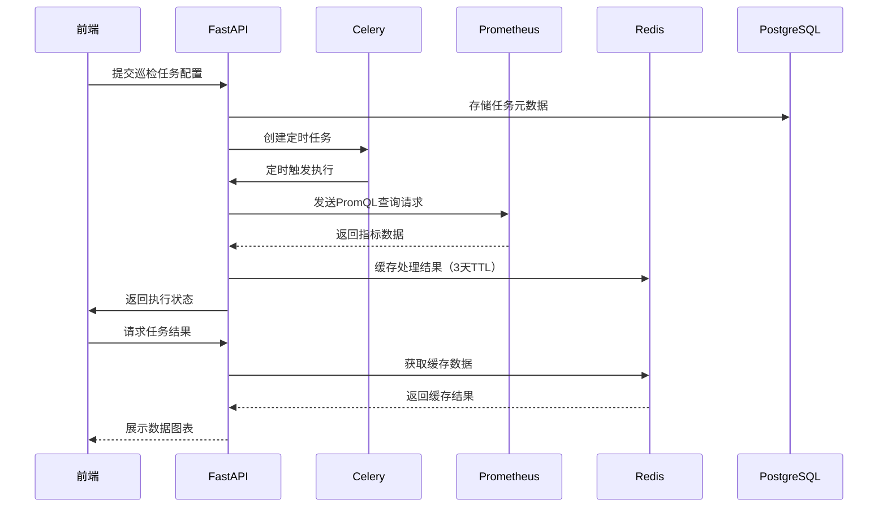

# SRE自动化运维工具
- 项目简介

- 项目结构规划
```bash
├── frontend/               # 前端项目
│   ├── public/            # 静态资源
│   ├── src/
│   │   ├── api/           # 接口定义
│   │   ├── stores/        # Pinia状态管理
│   │   ├── views/         # 页面组件
│   │   │   ├── Task/
│   │   │   ├── Dashboard/
│   │   ├── utils/         # 工具函数
│   │   └── main.ts
│
├── backend/               # 后端项目
│   ├── app/
│   │   ├── core/         # 核心逻辑
│   │   │   ├── prometheus_client.py
│   │   │   └── alert_manager.py
│   │   ├── db/           # 数据库层
│   │   ├── models/       # Pydantic模型
│   │   ├── routes/       # 路由控制器
│   │   ├── tasks/        # Celery任务
│   │   └── config.py     # 配置管理
│   ├── requirements.txt
│   └── main.py
│
├── docker-compose.yml     # 容器编排
└── .env                   # 环境变量
```

- 数据流
